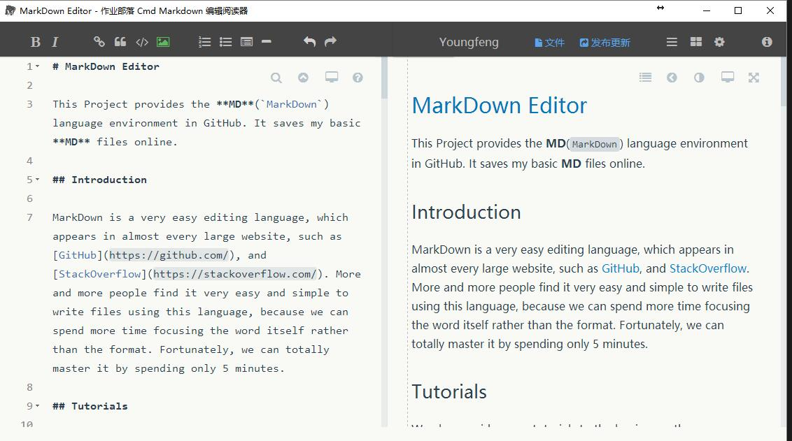

# MarkDown Editor

This Project provides the **MD**(`MarkDown`) language environment in GitHub. It saves my basic **MD** files online.

## Introduction

MarkDown is a very easy editing language, which appears in almost every large website, such as [GitHub](https://github.com/), and [StackOverflow](https://stackoverflow.com/). More and more people find it very easy and simple to write files using this language, because we can spend more time focusing on the word itself rather than the complicated formats. Fortunately, we can totally master it by spending only 5 minutes. 

To better utilze this wonderful language, I strongly recommand a free MD editor [LiteIDE](http://liteide.org/cn/), which supports the convertion from **MD** file to **PDF** file. What's more, I also overwrite a css file [xp.css](docs/xp.css) in the project (you can also overwrite this css file on your computer).

## Tutorials

We also provide some tutorials to the beginners, they are,

+ [Markdown: Syntax](https://daringfireball.net/projects/markdown/syntax)
+ [Markdown——入门指南](http://www.jianshu.com/p/1e402922ee32/)
+ [Markdown 语法说明 (简体中文版)](http://wowubuntu.com/markdown/#list)

## Syntax
Here are some syntax and notes you should pay attention to while writing this language.

### **1. Title**
We have three kinds of title styles, we only need add symbol **`#`**, **`##`**, **`###`** in front of title context.

```markdown
# this is an H1
## this is an H2
```

EXAMPLE:

# this is an H1
## this is an H2


### **2. Equation**
We can easily implement the equation if we want to reference some words. Adding **`>`** in front of the equation.

```markdown
> China is sending an envoy and delegation to North Korea - A big move, we'll see what happens!.
> - Trump
```

EXAMPLE:

> China is sending an envoy and delegation to North Korea - A big move, we'll see what happens!.
> - Trump


### **3. Listings**
We use **`+`**, **`-`**, and **`\*`** to mark the listings, and all these three symbol have the same result.

```markdown
+ Goldman Sachs CEO says U.K. should vote again on Brexit.
- VW has a $12B plan for electric cars in China.
* Semens is cutting 6,900 jobs.
```

EXAMPLE:

+ Goldman Sachs CEO says U.K. should vote again on Brexit.
- VW has a $12B plan for electric cars in China.
* Semens is cutting 6,900 jobs.


### **4. Code**
We have simple to way to demostrate the different code segments by inserting code into <code>\`\`\`</code> {:code} <code>\`\`\`</code>.

```markdown
```java
public static void main(String[] args){
    System.out.println("Hello, MarkDown!");
}```
```

EXAMPLE:

```java
public static void main(String[] args){
    System.out.println("Hello, MarkDown!");
}
```


### **5. Link**

If we want to refer to a website in our text, we'd better use `[:name](:links)` to show the website links. Click the hyper-links we can redirect to the website.

```markdown
We can visit [Baidu](http:www.baidu.com), but we cannot visit [google](http://www.google.com/) in China.
```

EXAMPLE:

We can visit [Baidu](http:www.baidu.com) but we cannot visit [google](http://www.google.com/) in China.


### **6. Table**
Table is a common elements in our daily word file. In MarkDown, we can implement it in the following way.

```markdown
| BOOK NAME | AUTHOR | PRESS | PRICE |
| --- | --- | --- | --- |
| Intro. to GITHUB | Hongji Dazhong | Posts&Telecom | ￥39.00 |
| Intro. to MarkDown | Mingming | Wuhan Uni. | ￥50.00 |
```

EXAMPLE:

| BOOK NAME | AUTHOR | PRESS | PRICE |
| --- | --- | --- | --- |
| Intro. to GITHUB | Hongji Dazhong | Posts&Telecom | ￥39.00 |
| Intro. to MarkDown | Mingming | Wuhan Uni. | ￥50.00 |


### **7. Image**
To rich the text we have writed or improve the word's readability, and the method of inserting a image is similar to that of inserting a link.

```markdown

```

EXAMPLE:


### **8. Mathematical**
The syntax of MarkDown is the same with LaTeX(such as __youdao cloud__ and __cmd Markdown__), so all the symbols are list in the file [docs](docs/HTML_symbols.pdf). But we must note that some MD compilers CANNOT get the right results using LaTeX directly(such as __GitHub__ and __StackOverflow__), so in that time we can only use HTML symbols to replace part of them.

```markdown
&alpha; + &beta; = &gamma;
```

EXAMPLE:

&alpha; + &beta; = &gamma;


### **9. CheckBox**
MarkDown can provide the function of checkbox when you want to emphase some points, using `- [ ]` or `- [x]`

```markdown
- [ ] buy a book.
- [x] play a game.
```

EXAMPLE:

- [ ] buy a book.
- [x] play a game.


### **10. Footnote**
When we want to explain some terms or events, we can use foornote which recored in the bottom of the pages. using `[^ ]` to keep note.

```markdown
We want to reference a paper [^1] here.
[^1]: Gu, Yongfeng, J. Xuan, and T. Qian. "Automatic Reproducible Crash Detection." SATE 2016, 2016:48-53. 
```

EXAMPLE:

We want to reference a paper [^1] here.
[^1]: Gu, Yongfeng, J. Xuan, and T. Qian. "Automatic Reproducible Crash Detection." SATE 2016, 2016:48-53. 
- - -
